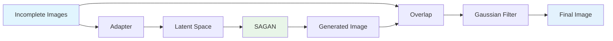

# FILL-GAN-NET: Unsupervised Image Inpainting via Self-Attention GANs

FILL-GAN-NET is a deep learning model for **image inpainting without the use of explicit masks during training**. It leverages a **Self-Attention GAN (SAGAN)** trained on the CelebA dataset to generate realistic face images, and then applies a lightweight **adaptor network** to learn the inpainting task from incomplete inputs.

---

## Key Features

-  **Unmasked Inpainting**: No masks are required during GAN training.
-  **Adaptor Network**: Learns to fill missing regions post GAN training.
-  **SAGAN Backbone**: Enables globally coherent image generation with long-range dependencies.
-  **CelebA Dataset**: Model is trained on thousands of face images from CelebA for realistic and diverse reconstructions.
-  **Smooth Final Output**: Combines generated outputs and incomplete inputs using **Gaussian filtering** for seamless inpainting.

---

##  Architecture




---

##  Dependencies

This project requires only minimal dependencies:

```text
torch
numpy
```
